#                                                       Cucu's												

------

​																	

## Desarrolladores

- ## Los Moñecos

   - Manuel Adeliño Consuegra

   - Rodrigo Tobar Guillén 

   - Rubén González Ortiz

   - Jonathan Sebastián Andrade Gordillo

     

     ​	

     

     

     #### 																			    Preview videojuego																														

     

### Puede ver nuestro código en : https://github.com/rubenglezortiz/PVLI-2020-21-CUCU-PROLOGUE

Y nuestro proceso de desarrollo en : 

# GDD

***CUCU's***

**Documento de diseño de videojuego**

*Nombre de los autores o la empresa*

*Sitio web o correo electrónico de contacto*

Versión 1.2 - 19 de septiembre de 2019

| **Resumen**                  |                                |
|-------------------------------|:------------------------------:|
| **Géneros:** Rol.             | **Modos:** Individual          |
| **Público objetivo:** ...\  *Edad, sexo, región e idioma*  | **Plataformas:** PC, buscador. |
| **Características:** Top Down |                                |

# Descripcion
----------------------------------------
  **Logotipo y portada del juego !**
  ----------------------------------------

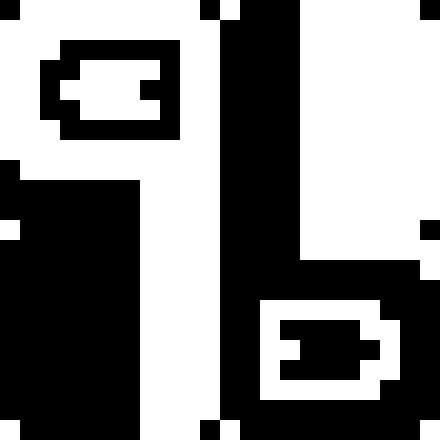

**1. Aspectos generales**

**2. Menús**

+ 2.1 Menú de inicio

+ 2.3 Menú de interacción con los muñecos

**3. Configuración, interfaz y controles**

+ 3.1 Configuración 

+ 3.2 Interfaz y control 

**4. Jugabilidad**

+ 4.1 Mecánica

+ 4.1.1 Movimiento e interacción

+ 4.1.2 Enfrentamiento contra enemigos

+ 4.1.3 Objetos

+ 4.2 Dinámica

+ 4.2.1 Dinámica puzzles

+ 4.2.2 Dinámica muñecos

+ 4.3 Estética 

**5. Contenido**

+ 5.1 Historia

+ 5.2 Mapa

+ 5.3.Personajes

+ Juan

+ Pomponina

+ Don Lindo

+ Agalzapo 

# 1. Aspectos generales

Es un juego de rol con una perspectiva top-down. El personaje podrá moverse en todas direcciones. Algunas de las características claves del mismo son: el diálogo del jugador con los demás personajes, dado que la trama tendrá un peso importante en el juego, y el combate, que se basará en un sistema de minijuegos distintos entre sí basados en esquivar proyectiles.

El objetivo principal del juego será eliminar/salvar a los muñecos escapados mientras evitas morir en combate, pudiendo darse diversos resultados dependiendo de tus acciones

# 2. Menús

## 2.1  Menú de combate con los muñecos

Este menú aparece al acercarse a un personaje y pulsar el botón de interacción

-   **Atacar**: Al darle a atacar comienza el minijuego de ataque del muñeco en cuestión.

-   **Hablar**: Las opciones del menú de combate se cambian por las distintas opciones de diálogo del personaje. P.e: Atacar → Chiste, Hablar → Halago \...

-   **Piedad**: si los PP están a 100, al darle se acaba la pelea y perdonas al muñeco , salvándolo. Si no están a 100, aparece el minijuego y el jugador pierde su turno.

Al acabar de interaccionar con el muñeco (haberle matado o salvado) se cierra el menú. El jugador se encontrará donde interactuó con el muñeco, solo que este ya no estará ahí.

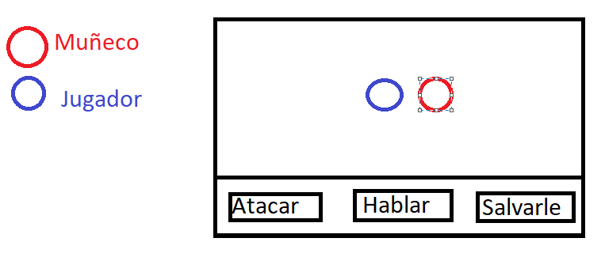

#  

# 3. Configuración y controles

## 3.2 Interfaz y control

- No hay interfaz fuera de combate.
  - Al acercarse a un prop interactuable aparece una “E” para indicar que se puede pulsar esa tecla.

- Interfaz dentro de combate:
  - Vida del personaje la esquina superior izquierda.

# 4. Jugabilidad

## 4.0 Arquitectura

El juego se estructura de la siguiente forma:

## 4.1 Mecánica 

### 4.1.1 Movimiento e interacción

El jugador se podrá mover en todas las direcciones de los ejes X Y con las teclas WASD para moverse en dirección norte, sur, este y oeste respectivamente, y la combinación de esas direcciones, completando un movimiento 8D. Por otra parte, con la tecla “E” podrá interactuar con el escenario, ya sea con objetos o personas.

### 4.1.2 Enfrentamiento contra enemigos

El jugador tendrá 10 puntos de vida. En pantalla habrá un texto indicándole los PV restantes. Si llegan a 0, Pigmalión muere y reaparece en un punto de guardado. Los muñecos tendrán 100 puntos de vida.

Al igual que con Pigmalión, si llegan a 0 morirán. Al empezar un combate la vida del muñeco está siempre al máximo. 

El muñeco además tendrá unos **Puntos De Persuasión** que subirán si Pigmalión selecciona las opciones adecuadas al hablar y bajarán cuando pase lo contrario. Estos puntos no serán visibles para el jugador.

El enfrentamiento tendrá dos fases, una de toma de decisiones y otra más dinámica.

La primera fase del combate consta de una toma de decisiones, nombradas en el punto 2 del documento:

**FASE 1**

La segunda fase empieza cada vez que elegimos una opción en la fase uno.

En ella el jugador maneja al personaje principal y tendrá que esquivar los ataques del enemigo, perdiendo puntos de vida en caso de no conseguirlo.

Si el muñeco está por debajo de la mitad de la vida, esta fase se dificultará de distintas formas dependiendo del muñeco(más proyectiles, más rápidos, etc).

Tras esquivar todos los ataques, volveremos a la primera fase del enfrentamiento y tendremos que tomar nuevas decisiones. Los minijuegos están explicados en cada personaje.

**FASE 2**

**Atacar:** Cuando elijamos esta acción, aparecerá un minijuego con el que se establecerá la cantidad de daño a infligir. Aparecerá un rectángulo horizontal con dos barras verticales que se moverán desde las esquinas hasta el centro a diferente velocidad. El jugador, presionando la tecla "Espacio", parará las barras. Cuanto más cerca estén, más daño se hará.

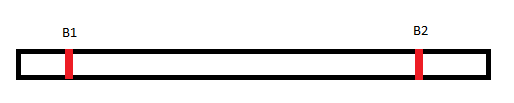

**Hablar:**  El jugador tendrá diferentes opciones para hablar con los muñecos, en función de qué puzzles haya resuelto a lo largo del mapa, podrá elegir más opciones. Las opciones serán beneficiosas o perjudiciales. Si elige una buena, subirán los Puntos de Persuasión, una medida invisible al jugador, que cuando llegue al máximo, el jugador podrá acabar el combate salvando al muñeco. También hay opciones que no acarrean ningún efecto.

**Piedad:** Cuando los puntos de persuasión lleguen a 100 podrás salvar al muñeco dándole a esta opción. Se acabará el combate al instante. 

### 4.1.3 Objetos

Se obtendrán al completar los puzzles (o parte de ellos) a lo largo del mapa y se podrán usar, una vez conseguidos, en la opción "**Hablar**".

# 4.2 Dinámica

### 4.2.1 Dinámica puzzles

Se pueden obtener unos objetos u otros que servirán para facilitar la opción pacifista del juego mediante la exploración del escenario y con la interacción con los personajes que nos iremos encontrando.

### 4.2.2 Dinámica muñecos

La dinámica del juego estará dirigida por las decisiones que tome el jugador a la hora de enfrentarse a los enemigos.

Dentro de la batalla, el jugador tendrá la opción de, o bien matándolos a base de ataques, o bien, hablar con el fin de llegar al máximo de **Puntos De Persuasión**.

Esto diferenciará a su vez tres rutas de juego:

-   **Puppetcidal:** Matará a todos los muñecos.

-   **Pacifista:** Acabará dialogando con todos los muñecos.

-   **Normal:** Se matarán a unos muñecos y a otros no.

En **Historia** explicamos qué sucede en función de la ruta elegida por el jugador.

## 

##  4.3 Estética

La estética general del juego será parecida a la de Undertale, con un mundo abarcable en dos dimensiones (salas sobre las que te puedes mover) y sprites de personajes (protagonista, enemigos, extras\...) de cara al jugador.

El juego por fuera tendrá una estética de representación teatral, es decir, la pantalla de juego se verá como si fuese el escenario de una obra de teatro.

Cada una de las tres zonas en las que se divide el juego tendrá una estética y ambientación distintas.

# 5. Contenido

## 5.1 Historia

Pigmalión es un dramaturgo que se gana la vida usando a unos muñecos que están vivos los cuales ha creado él mismo. Sin embargo, un día estos muñecos deciden escaparse. Ahora Pigmalión, furioso, tiene dos opciones, o bien, eliminarlos por desobedecerle y crear otros, o bien, encontrarles para que vuelvan y puedan continuar su vida tal y cómo era. ¿Estará dispuesto a hacer lo que sea con tal de lograr su objetivo?

Como se ha explicado en la dinámica, la historia podrá seguir las siguientes rutas:

-   Ruta pacifista. En esta ruta, todos los muñecos vuelven al teatro a seguir viviendo con Pigmalión. En esta ruta, aparecerá un último muñeco, Urdemalas, que tras ver que todos sus compañeros están de vuelta en el teatro, se queda también en él.

-   Ruta puppetcidal: En esta ruta, aparecerá también, Urdemalas. En este caso buscará vengarse de Pigmalión. Solo podrá ser eliminado, ya que el jugador no podrá hablar con él.

-   Ruta normal. En esta ruta, los muñecos que queden vivos, huirán del teatro.

## 5.2 Mapa

El mapa será un mundo abierto, marcado por tres diferentes zonas, más una zona central (el teatro). Cada zona trata un solo muñeco, así como sus puzzles.

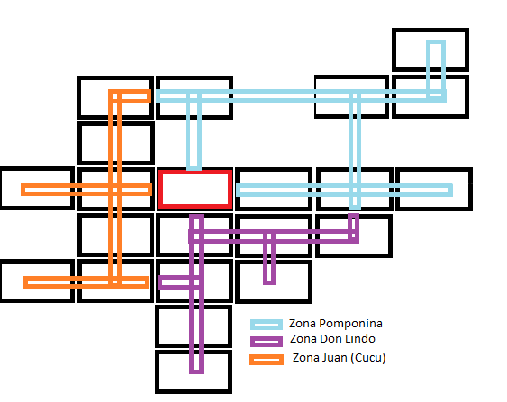 

## 5.3.Personajes

Cosas comunes a todos los personajes:

-   Minijuego. El minijuego cambiará de fase cuando la salud del muñeco baja del 50%.

-   Objetos. En las opciones de chat, se mostrarán solo las opciones desbloqueadas (esto va principalmente por los muñecos con los que se pueden desbloquear distintos objetos).

-   Diálogos: Una vez seleccionada la opción de habla, se cambiará el dialogo de las cuatro principales opciones a las opciones de chat de cada personaje

Dependiendo del personaje, además, se podrá abrir un submenú de cosas que ofrecer que el jugador puede obtener a través de quests de cada personaje

## CUCU

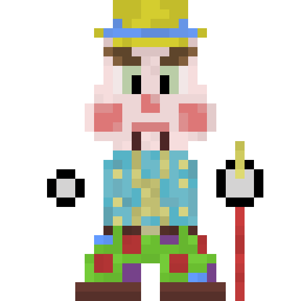

### DESCRIPCIÓN:

Personalidad burlesca

Este muñeco fue creado con la intención de hacer comedia. No puede hablar porque fue uno de los primeros muñecos creados por pigmalión. lo único que puede decir es "Cu cu". Dependiendo de la entonación que le ponga puede significar burla, amenaza, enfado\....

 En el juego. Además de acompañar cada cucu con una descripción de la intención del cucu se puede distinguir cada cucu dependiendo de la fuente de éste.

 Todos los muñecos le hacen burla y no es muy querido.

**Conversaciones**

Salvar:

-Pigmalión: Menos mal que te vuelves conmigo, eres el único capaz de hacer reír a la gente.

-Juan: CUCU :3

Matar:

-Pigmalión: Fuistes de mis primeros muñecos, se nota lo inferior que eres. Ahora podré rehacerte y mejorarte.

-Juan: cu cu

### INFORMACIÓN

**Disfraz de payaso**

-Buena: Chiste.

-Pigmalión. pensando(Al principio Juan se reía por cualquier tontería, no se cuanto tiempo llevo sin verle sonreír).

**NPC calle**

-Buena: Animarle

-NPC: "He visto un señor vestido raro ir dirección hacia el rastro estuvo un rato en la verbena, parecía estar disfrutando como un niño pequeño, no paraba de reir.

**NPC calle**

\- Info muñecos humanos: hay un carrito de bebe. Al interactuar con él sale un diálogo que explica quey cucu calmó al bebe. Al preguntarle por esa persona le dice que volvió por donde vino.

CONVERSACIONES

**Encuentro**

-Muñeco: CU CU (con gesto de sorpresa)

-Pigmalión: Por que te has escapado zoquete?!

-Muñeco: cu cu

-Pigmalión: Con que te vas a comportar así ahora eh?

-Muñeco: **CU CU! (le saca la lengua)**

-Pigmalión: Pues que así sea!

OPCIONES DE CHAT

\- **(Buena): Chiste.**

Una vez seleccionada esta opción Pigmalión dice al azar uno de estos:

1\. -Pigmalión: ¿Sabes cómo se queda un mago después de comer? Cucu: ...Pigmalión: Magordito

\- **(Mala): Reírse de él**

-   JAJAJAJAJAJA CUCU(riéndose de él)

-   CU CU! \>:(

**-(Buena): Animarle**

1.  

-   Aunque los demás se rían de ti, yo sé que eres especial

-   CUCU :3

**- (Indiferente): Dato**

1.  

-   ¿Sabías que Los búhos son las únicas aves que pueden ver el color azul?

-   Cucu: 👍.

# 

-   ¿Sabias que Un caracol **puede dormir por 3 años.?**

-   Cucu: 👍.

#    

-   ¿Sabías que Fast and Furious 8 está disponible para Netflix EEUU pero no para Netflix ESPAÑA?

-   Cucu: 👍.

### TABLA DE PUNTOS DE PERSUASIÓN                                          
------------------------------- ------------ -------------- ---------- ------------
**TOTAL**                       **Chiste**   **Animarle**   **Dato**   **Reírse**

    100             +10     +15      +0    -5

**MINIJUEGO (Descripción de la mecánica del muñeco):**

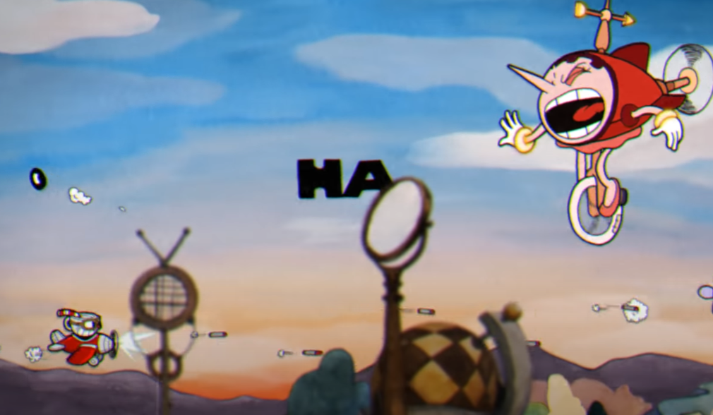

El minijuego se parece a este jefe del cuphead, sustituyendo los HA por CU que vayan en grupos de dos.

El jugador puede moverse libremente por la sala, pero si entra a la zona en la que está el muñeco, pierde vida. La zona del muñeco tiene CuCus flotando y que no salen de ella, cuando el muñeco vaya a tirar un cucu, aparece un CuCU diminuto en esta zona, que se va haciendo grande hasta alcanzar su tamaño, y en ese momento se lanza.

El muñeco le lanzará proyectiles, los cuales se verán como "CU CU", al ser lo único que puede decir el muñeco. Al principio los cucus salen juntos, como en la siguiente imagen:

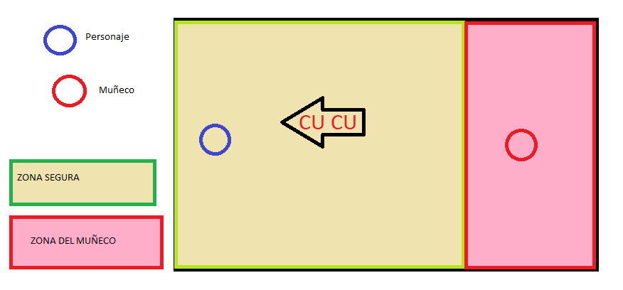

Pero según se va avanzando en el minijuego puede lanzarlos sin que los dos CUs vayan seguidos.

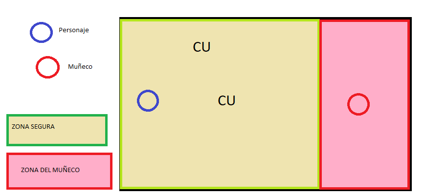

**ZONA de CUCU**

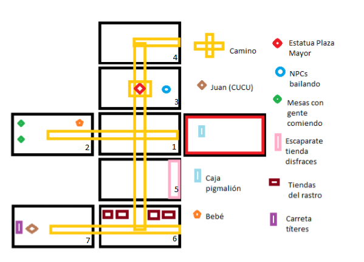

1-Calle normal, un par de mesas con y un bebe (mirar info de CUCU).

2-Plaza Mayor: (Al entrar empieza a sonar la canción Madrid, Madrid, MAdrid de Placido Domingo https://www.youtube.com/watch?v=KWNZ_w3c3ls&ab_channel=Nisusline)Aquí está la estatua para reconocerla y al lado un par de NPC vestido de chulapos y chulapas dando circulos (bailando). Además hay otros NPC mirando, al preguntarles dicen que vieron a una persona muy rara(vestido como un payaso) que estuvo un rato mirando y cogió la calle que va al rastro. (mirar info)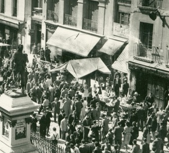

4- Calle normal, conexión con la zona azul.

5- Calle normal, hay una tienda de disfraces y se ven el de un payaso. Info de nariz de payaso.

6- Conexión con zona Morada, es el rastro. Hay un par de puestos.

7- Sala de cucu. hay una pequeña carpa con dos títeres, uno de ellos es igual que cucu

##  Pomponina

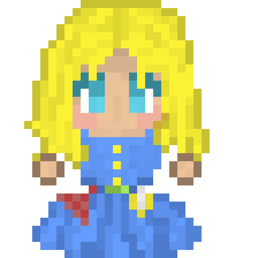

### CONVERSACIONES

**POMPONINA:** No sé por qué has venido hasta mí, no pienso volver contigo.

**PIGMALIÓN**: No seas boba, no tienes ningún sitio a dónde ir.

**POMPONINA:** ¡Me da igual! encontraré a alguien que me lleve consigo. Además, seguramente será más divertido que tú.

**PIGMALIÓN**: Tu sitio es aquí, en el teatro, conmigo y tus compañeros

**POMPONINA:** No me interesa el teatro, no me interesan mis compañeros, y mucho menos me interesas tú.

### SI SE SALVA A POMPONINA:

**POMPONINA:** Creo que después de tanto tiempo al fin empezamos a entendernos. Te daré otra oportunidad, pero más te vale que me trates como a la estrella que soy.

### SI SE MATA A POMPONINA:

**POMPONINA:** No puede acabar así\...todavía necesita...mi\...ayuda\...

**INFORMACIÓN**

-   **ESPEJO**

    -   **[PIGMALIÓN PENSANDO**: Pomponina estaba siempre mirándose al espejo, le gustaba estar arreglada, y mucho más que le dijeran lo guapa que estaba.

-   **ABANICO ROTO (PUZZLE) (DESBLOQUEA OPCIÓN CHAT)**

    -   **PIGMALIÓN PENSANDO**: Quizás se podría arreglar en alguna parte.

-   **COLLAR (PUZZLE) (DESBLOQUEA OPCIÓN DE CHAT)**

    -   **PIGMALIÓN PENSANDO**: Le gustará como cualquier otra joya, Pomponina es muy básica.

-   **CAJA DE BOMBONES (PUZZLE) (DESBLOQUEA OPCIÓN CHAT)**

    -   **PIGMALIÓN PENSANDO**: Podría darle estos bombones a Pomponina.

-   **RAMO DE ROSAS (PUZZLE) (DESBLOQUEA OPCIÓN CHAT)**

    -   **PIGMALIÓN PENSANDO**: Debería llevárselo a su hijo, pero a Pomponina siempre le han gustado mucho las rosas\...

-   **RAMO DE ROSAS ROSAS(PUZZLE) (DESBLOQUEA OPCIÓN CHAT)**

    -   **PIGMALIÓN PENSANDO**: Las rosas favoritas de Pomponina son las de color rosa. Estoy seguro de que le encantarían.

**OPCIONES DE CHAT**

-   **(BUENA): Halagar (desbloqueada) Se escoge aleatoriamente una opción. Se puede repetir.**

    -   **PIGMALIÓN:** ¡Cuidado! No debes ponerte bajo el sol

        -   **POMPONINA:** ¿Se puede saber por qué me dices eso ahora?

    -   **PIGMALIÓN:** Porque te derrites bombón

        -   **POMPONINA:** Tendré cuidado, a nadie le gustan los bombones derretidos

    -   **PIGMALIÓN:** ¿No serás un compuesto de Fósforo, Erbio, Hierro, Carbono y Tántalo?

        -   **POMPONINA:** ...

    -   **PIGMALIÓN:** Porque eres PErFeCTa

        -   **POMPONINA:** Me encantan tus halagos tan creativos aunque no los entienda.

    -   **PIGMALIÓN:** Tanto gentile e tanto onesta pare

        - la donna mia quand'ella altrui saluta,

        - ch'ogne lingua deven tremando muta,

        - e li occhi no l'ardiscon di guardare.

-   **POMPONINA:** Come parli italiano elegante

-   **(INDIFERENTE): Ordenar (desbloqueada) Se escoge aleatoriamente una opción. Se puede repetir.**

    -   **PIGMALIÓN:** Vuelve a tu caja.

    -   **POMPONINA:** ¡No me da la gana!

    -   **PIGMALIÓN:** Para de seguir con tus tonterías y vuelve ya.

    -   **POMPONINA:** No quiero, no voy a seguir haciéndote caso.

    -   **PIGMALIÓN:** No sé a qué estás esperando, pero tienes que volver a ensayar.

    -   **POMPONINA:** Yo ya no voy a volver a participar en tus nefastas farsas.

-   **(MALA): Amenazar (desbloqueada) Se escoge aleatoriamente una opción. Se puede repetir.**

    -   **PIGMALIÓN:** vas a tener un castigo muy gordo como no vengas conmigo

    -   **POMPONINA:** siempre estás igual, estoy cansada de tus castigos, no pienso volver

    -   **PIGMALIÓN:** Como no vengas ahora mismo no te volveré a hacer regalos

    -   **POMPONINA:** Con mi belleza habrá cientos de personas que me harán regalos mejores que los tuyos

    -   **PIGMALIÓN:** Voy a tomar serias represalias contra ti

    -   **POMPONINA:** Tú mismo, sabes que soy indispensable para ti.

-   **(MUY BUENA): Ofrecer bombones (desbloquear por puzzle)**

    -   **PIGMALIÓN:** (Ofrecer caja de bombones) Toma. Esto me lo dió una anciana a la que ayudaste para que te lo trajese.

    -   **POMPONINA:** (Lo acepta) (!) ¿Ha conseguido mantener el negocio?

    -   **PIGMALIÓN:** Sí, y todo gracias a tí. Esa es la razón por la que creo que nos podemos entender.

    -   **POMPONINA:** Gracias por traérmelo. (\...) ¿De verdad no estás enfadado?

    -   **PIGMALIÓN:** No, de hecho nunca he estado tan orgulloso de ti como ahora.

**NOTA: Todos los ramos de rosas se llamarán "Ramo de rosas" para el jugador. Éste no distinguirá los tipos de ramos por el nombre.**

**- (MUY BUENA): Ofrecer ramo de rosas rosas (desbloquear por puzzle)**

-   **PIGMALIÓN:** (Ofrecer ramo de rosas) Pensé que una forma de disculparme

-   **POMPONINA:** (Lo acepta) Oh, ¡Qué bien! Mi abanico se me había roto y necesitaba uno nuevo.

**- (BUENA): Ofrecer ramo de rosas (desbloquear por puzzle)**

-   **PIGMALIÓN:** (Ofrecer ramo de rosas) Te he traído estas rosas. Como siempre te han gustado pensé que te alegrarían.

-   **POMPONINA:** Ohh, son muy bonitas, quizás podríamos llegar a entendernos.

**- (MALA): Ofrecer ramo de rosas malo (desbloquear por puzzle)**

-   **PIGMALIÓN:** (Ofrecer ramo de rosas) Te he traído estas rosas. Como siempre te han gustado pensé que te alegrarían.

-   **POMPONINA:** (Sonríe) ¡Claro que me gustan! (Se enfada) ¡CUANDO NO SON TAN FEAS COMO ESTAS!

-   **(BUENA): Ofrecer abanico**

    -   **PIGMALIÓN:** (Ofrecer abanico) Encontré tu abanico roto. Como le tenías tanto cariño decidí ir a un anticuario para que lo reparasen.

    -   **POMPONINA:** (Lo acepta) Ohh ¡qué detalle! Muchas gracias, Pigmalión. Parece que te importo más de lo que pensaba.

-   **(MALA): Ofrecer collar**

    -   **PIGMALIÓN:** (Ofrecer collar) Te he traído un collar. A las chicas os encantan estas cosas, ¿no?

    -   **POMPONINA:** ¡No! Te he dicho muchísimas veces que no me gustan los collares! Si vas a tener un detalle deberías darme algo especial para mí, no cualquier baratija que encuentres por ahí.

Se mostrarán las tres opciones desbloqueables además de un botón para ofrecer cosas, una vez le das al botón de ofrecer cosas se sustituirán las opciones anteriores por las de ofrecer los diferentes objetos que el jugador haya recogido. En caso de que no los haya conseguido los objetos se mostrarán en gris.

 TABLA DE PUNTOS DE PERSUASIÓN                                                                        
------------------------------- ---------------------- -------------- ------------- ---------------- -------------
**TOTAL**        **Ramo rosas rosas**   **Bombones**   **Abanico**   **Ramo Rosas**   **Halagar**
    

     100         +40             +30        +30      +20       +12
**-**          **Ordenar**            **Amenazar**   **Collar**   

         0              -5         -20                  

**MAPA**

**- Zonas y ambientación**

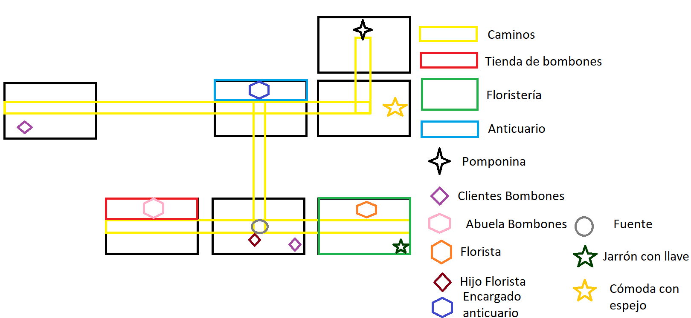

1.  **Tienda de bombones.** Aquí estará la anciana que lleva la tienda y que nos hará un encargo.

2.  **Plaza con fuente.** Tiene al hijo del de la floristería, a un cliente de la tienda de dulces y la llave. Conecta con la zona verde ( Don Lindo)

3.  **Floristería.** Aquí tendremos a un encargado en apuros y una llave en un florero vacío.

4.  **Calle.** Hay un cliente de la tienda de dulces. Conecta con la zona azul (Cucu)

5.  **Anticuario.** Lugar donde podremos comprar algo o reparar el abanico.

6.  **Casa de Pomponina.** Tiene el espejo y el cajón donde está el abanico.

7.  **Cuarto de Pomponina.** Solo está ella. habitación despejada donde transcurre el combate.

La zona de Pomponina va a estar ambientada en la alta sociedad burguesa de la ciudad. Habrá elementos tales como farolas elegantes, árboles y jardines cuidados, alguna fuente, etc. La gente de la zona iría con traje, bombines, monóculos, vestidos, etc, a excepción de algunos personajes más humildes, los cuales están allí trabajando para la clase alta.

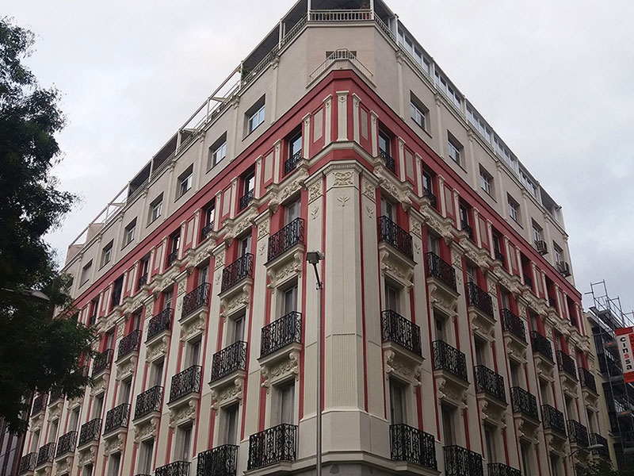)

**PUZZLES**

**-Abanico/Collar**

1.Si vamos a casa de Pomponina, nos encontraremos con un cajón con el que si intentamos interactuar descubriremos que está cerrado con llave.

2.Al ir a la plaza con fuente al interactuar con ella obtendremos la llave.

3.Al abrir el cajón, encontraremos un abanico roto. Pigmalión pensará que se podría arreglar.

4.Si vamos al anticuario,el encargado nos dará la opción de comprar uno nuevo. Si hablamos con el anticuario sin tener el abanico roto, Pigmalión comprará un collar.

**-Ramo de rosas malo, ramo de rosas y ramo de rosas rosas**

1\. Al llegar a la floristería, nos encontraremos con un dependiente que ha perdido la llave de la trastienda. Pedirá a Pigmalión que si la ve que le avise.

2\. Cerca habrá un florero vacío. Al interactuar con él, obtendremos la llave de la trastienda.

3\. Al darle la llave, el encargado le regalará un ramo de rosas que se le había olvidado a su hijo.

4\. A partir de este momento Pigmalión tiene dos opciones: entregarle el ramo al hijo o dárselo a Pomponina. Si decide ir a la fuente y dárselo al hijo, tendrá una conversación con él.

5\. Tras esto, si vuelve a la floristería, el dependiente estará tan encantado con Pigmalión que decidirá regalarle un ramo de rosas rosas.

**-Caja de bombones**

1.  Si vamos a la tienda de dulces caseros nos encontraremos a una anciana que nos pedirá llevar unos pedidos a unos clientes que hay por la zona.

2.  Deberemos ir a esas zonas e interactuar con los personajes que encontraremos. Al darles sus pedidos a todos, podremos volver a la tienda.

3.  Al llegar, la anciana nos lo agradecerá. Pigmalión le preguntará por Pomponina y la abuela nos dará información y una caja de bombones para Pomponina.

**MINIJUEGO**

Pomponina lanzará abanico tornados. Éstos se comportarán como simples proyectiles que no avanzarán en línea recta, sino en zig-zag ya que rebotarán en las paredes al chocar contra ellas.

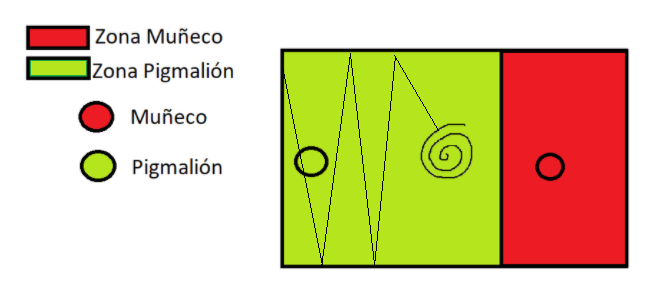

Cuando Pomponina tenga la vida reducida a la mitad, lanzará tres tornados en vez de uno, con la misma mecánica para los tornados de los lados, siendo el del centro un proyectil que avanzará de forma recta.\

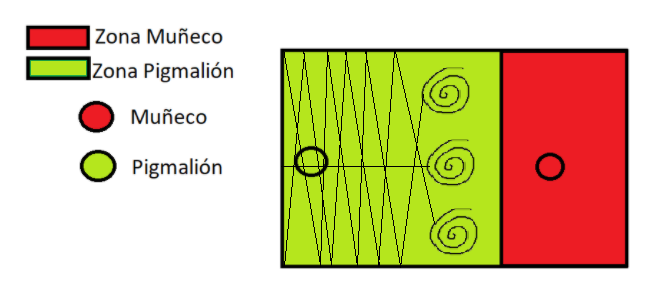

### Don Lindo

### 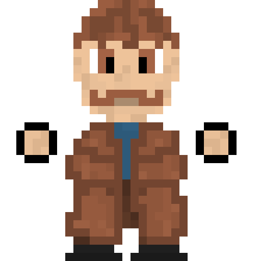

### 

**CONVERSACIONES**

**PIGMALIÓN:** Don Lindo, tú que eres de los muñecos más sensatos, vuelve al teatro.

**DON LINDO:** No, sin el amor de Pomponina no voy a ninguna parte.

**PIGMALIÓN:** No tienes que depender de ningún muñeco, Don Lindo.

**DON LINDO:** No, no y no. No me iré a ninguna parte sin su amor, y menos contigo.

**SI SE SALVA A DON LINDO:**

**DON LINDO:** Bueno, creo que mi sitio está ahí en el teatro, haciendo la música de tus farsas. En verdad lo echo de menos.

**SI SE MATA A DON LINDO:**

**DON LINDO:** Vaya... Creo que ahora tendré que tocar con mi ukelele en algún otro lugar... Espero que Pomponina, por mucho que me duela, no esté allí viéndome, que se quede aquí... a salvo.

**INFORMACIÓN**

-   **FOTO DE POMPONINA CON UN CORAZÓN DIBUJADO:**

    -   **PIGMALIÓN PENSANDO:** Nunca imaginé que un muñeco se podría enamorar de otro.

-   **GORRO (PUZZLE) (DESBLOQUEA OPCIÓN CHAT)**

    -   **PIGMALIÓN PENSANDO:** Nunca le he regalado nada, espero que con el gorro le quite importancia a su peluca.

-   **UKELELE (PUZZLE) (DESBLOQUEA OPCIÓN CHAT)**

    -   **PIGMALIÓN PENSANDO:** Seguro que agradecerá recibir un ukelele. Lástima que el suyo lo hayan roto.

- **CARTERA: (PUZZLE) (DESBLOQUEA OPCIÓN CHAT)**

  -   **PIGMALIÓN PENSANDO:** Tendría que devolvérsela a su dueño. O puedo comprarle algo a Don Lindo. Incluso ofrecersela. A todo el mundo le gusta el dinero.

  

**OPCIONES DE CHAT**

-   **(BUENA): Música (desbloqueada) Se escoge aleatoriamente una opción. Se puede repetir.**

    -   **PIGMALIÓN**: Tienes que volver conmigo, las farsas necesitan de tu música.

    -   **DON LINDO:** ¿Tan importante es mi música?

-   **(INDIFERENTE): Gritar (desbloqueada)**

    -   **PIGMALIÓN:** ¡QUE VENGAS CONMIGO!

    -   **DON LINDO:** ¡QUE NO QUIERO!

-   **(MALA): Pomponina (desbloqueada) Se escoge aleatoriamente una opción. Se puede repetir.**

    -   **PIGMALIÓN:** Asume de una vez que Pomponina pasa de ti.

    -   **DON LINDO:** ¡Cómo osas!

-   **(MALA): Persuadir (desbloqueada) Se escoge aleatoriamente una opción. Se puede repetir.**

    -   **PIGMALIÓN:** Si no vienes conmigo te quitaré la peluca y te quedarás calvo.

    -   **DON LINDO:** Si me voy por mi cuenta podré comprar todas las pelucas que quiera.

-   **(MUY BUENA) Regalar gorro (desbloquear por puzzle)**

    -   **PIGMALIÓN:** Me han regalado un gorro, he pensado que te podría gustar tenerlo.

    -   **DON LINDO:** He de decir que esta vez tienes razón. ¡Me gusta! Gracias.

-   **(MUY BUENA) Dar ukelele (desbloquear por puzzle)**

    -   **PIGMALIÓN:** Siento decirte que unos gamberros han roto tu ukelele. Pero he podido conseguirte uno.

    -   **DON LINDO:** Gracias Pigmalión. Sabes que significa mucho para mí.

-   **(MALA) Regalar corbata(desbloquear por puzzle)**

    -   **PIGMALIÓN:** He comprado una corbata, creo que es de tu estilo.

    -   **DON LINDO:** Ooh... si te soy sincero... llevaba tiempo sin ver algo tan horrible. Sigues sin saber nada de nosotros, "tus muñecos". Decepcionante.

-   **(MALA) Dar cartera (desbloquear por puzzle)**

    -   **PIGMALIÓN:** Seguro que aceptas esta cartera con dinero para volver al teatro..
-   **DON LINDO:** A ver si te das cuenta de que no todo gira en torno al dinero, garrapata sin patas.
    

  
  
  
  ### TABLA DE PUNTOS DE PERSUASIÓN                                                 
  
  ------------------------------- --------------- --------------- ------------- ------------
  **TOTAL**                       **Ukelele**     **Gorro**       **Musica**    **Gritar**
        100     					+50           +40            +12           0
  **-**           **Persuadir**   **Pomponina**     **Cartera**
                   -5        	     -10      		 -30

**MAPA**

-   **Zonas y ambientación**

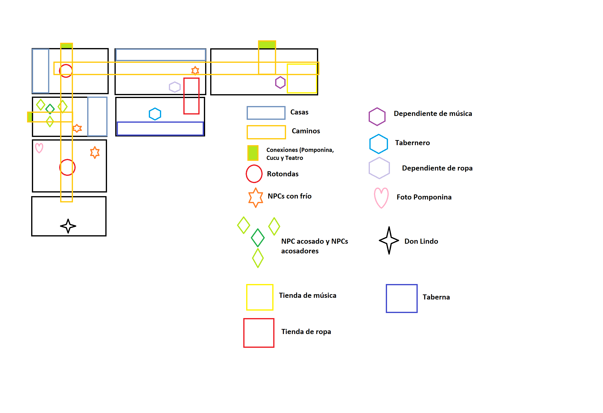

 **Plaza central.** Habrá un NPC, si interactuamos con él, dirá que tiene frío.

 **Tienda de ropa.** Habrá un NPC al que le podremos preguntar por don Lindo.

 **Floristería.** Tienda de música. Podremos adquirir un ukelele. (Conecta con la zona de Pomponina)

 **Taberna.** El tabernero será quien nos lleve al flashback de Don Lindo.

 **Zona Residencial.** Veremos a un chaval siendo acosado por un grupo de jóvenes. También veremos otro NPC que tiene frío. (Conecta con la zona de Cucu)

 **Calle vacía.** Una foto de Pomponina y una rotonda, sin más. Zona paupérrima del mapa.

**PUZZLES**

**-Gorro**

1.  Si hablamos con el dependiente de la tienda de ropa, le preguntaremos acerca de Don Lindo. Amablemente nos dirá que en este momento está muy liado, va con el tiempo justo y que no nos puede ayudar, pues tiene que repartir unos gorros, de forma gratuita a los habitantes de la zona.

    -   **PIGMALIÓN:** Perdona, ¿has visto por aquí a un tipo con traje y corbata, y que además parece que lleva una peluca?

    -   **DEPENDIENTE:** Me quiere sonar sí, pero ahora mismo no lo termino de recordar. Además, estoy muy liado. Tengo que ordenar toda la tienda y repartir estos gorros. ¿Te importaría echarme una mano con ellos? Mientras intentaré pensar en el hombre que me has dicho.

    -   **PIGMALIÓN:** Está bien, ¿a quién tengo que dárselos?

    -   **DEPENDIENTE:** A cualquier persona que veas que tiene frío por la calle, se acerca el invierno y, si entre todos colaboramos, haremos que sea menos duro.

2.  Repartiremos los gorros a los NPCs que tienen frío.

    -   **PIGMALIÓN:** Hola. Creo que este gorro es para ti.

    -   **NPC CON FRÍO:** Muchísimas gracias. No sabes lo bien que me viene.

3.  Si volvemos a la tienda, el dependiente nos dirá que Don Lindo estuvo hablando con él, que por eso iba justo de tiempo y, sin dar detalles de la conversación, nos ofrece un gorro para él, diciendo que se la ha olvidado dárselo a él antes.

    -   **PIGMALIÓN:** Ya los he repartido.

    -   **DEPENDIENTE:** ¡Muchísimas gracias! Supongo que antes te referías a Don Lindo, ¿me equivoco?

    -   **PIGMALIÓN:** En absoluto.

    -   **DEPENDIENTE:** Se pasó por aquí de casualidad, estuvimos hablando,un buen rato. Me comentaba cosas de un teatro y de una mujer por la que está muy enamorado por lo visto. Hasta tocó algo con un ukelele. Sin embargo, nos entretuvimos mucho y ha sido la causa por la que voy tan mal de tiempo. Sin darme cuenta, se me olvidó darle a él un gorro. ¿Te importaría dárselo de mi parte? Me da pena haberme olvidado de dárselo.

NOTA: Podemos ir a la tienda con la cartera, de esta forma compraremos una corbata.

**-Ukelele, cartera**

1.  Hablando por primera vez con el Tabernero, éste nos comentará simplemente que Don Lindo les dejó un momento el Ukelele mientras se iba a hacer algo, no especifica el qué. Sin embargo unos gamberros entraron a la taberna y lo rompieron.

    -   **TABERNERO:** ¡Malditos gamberros!

    -   **PIGMALIÓN:** ¿Qué sucede?

    -   **TABERNERO:** Pues mira, vino un hombre muy majo por aquí, como todos, con sus problemas, pero se notaba que era muy buena persona. Estuvimos charlando un rato y luego nos amenizó el día tocando un poco de música con un ukelele. Sin embargo, tenía que irse y, nos pidió que le guardásemos su ukelele, pero unos gamberros entraron y lo rompieron.

    -   **PIGMALIÓN:** ¡Menudos sinvergüenzas!

    -   **TABERNERO:** Completamente. Siempre están haciendo de las suyas... Ojalá alguien le pare los pies alguna vez.

    -   **PIGMALIÓN PENSANDO:** ¿Dónde podría conseguir un ukelele nuevo? A Don Lindo no le gustará ver que le han roto el suyo y no tener nada con lo que tocar.

2.  Pigmalion si va a la tienda de música, la dependiente le dirá a Pigmalión que ahora mismo está cerrado ya que ha perdido su cartera y no puede hacerse cargo de la tienda.

    -   **PIGMALIÓN:** Hola. Venía a comprar un...

    -   **DEPENDIENTE:** ¡Está cerrado!

    -   **PIGMALIÓN:** Pero si no es hora de cerrar.

    -   **DEPENDIENTE:** ¡He dicho que está cerrado! Acaban de venir unos gamberros y se han llevado mi cartera. No pienso atender a nadie.

    -   **PIGMALIÓN PENSANDO:** Creo que alguien debería pararle los pies a esos impresentables.

3.  En la Zona Residencial, si interactuamos con el chaval que está siendo acosado, espantaremos a los acosadores y el chaval te dará la cartera de la dependiente.

    -   **PIGMALIÓN:** Eh vosotros, sinvergüenzas, ¡dejad al joven en paz!

    -   (LOS GAMBERROS SE VAN)

    -   **JOVEN:** Muchísimas gracias buen hombre. Les he visto con una cartera que no es suya, sino de la dependiente de la tienda de música.

    -   **PIGMALIÓN:** La has cogido de vuelta y han ido a por ti, ¿verdad?

    -   **JOVEN:** Efectivamente. ¿Podrías llevársela de vuelta?

4.  Al volver a la tienda de música, como agradecimiento, la dependiente nos regalará.

    -   **DEPENDIENTE:** ¡Muchísimas gracias por traérmela de vuelta! Si te soy sincera, la daba por perdida. Toma este ukelele como agradecimiento.

NOTA: Si el jugador coge la cartera puede directamente ofrecérsela a Don Lindo, sin devolvérsela a la dependienta.

NOTA: Si el jugador coge primero la cartera en vez de hablar antes con la dependienta, saltará el paso 2 (directamente le dirá gracias y le dará el ukelele)

**MINIJUEGO**

Don Lindo atacará a Pigmalión lanzando dos notas musicales que rebotarán por las cuatro paredes de la sala. Pigmalión deberá tratar de esquivarlas para pasar de fase, lo cual sucederá después de un tiempo. Mientras rebotan las dos notas, Don Lindo no hará nada más a menos que esté enfadado.

Cuando la salud de Don Lindo baje a la mitad, además de las dos notas rebotantes, usará su mal genio para crear explosiones en la zona de pigmalión. La zona que va a explotar se verá como un círculo de un color distinto al del suelo, lo que permitirá al jugador tener tiempo para esquivarlo y que no sea arbitrario. En caso de impacto también le quitarán vida al jugador. Estas explosiones aparecerán durante toda la fase, pero nunca habrá dos explosiones en proceso simultáneamente, si no que se dejará un pequeño espacio de tiempo de dos o tres segundos entre cada una. (Según el tiempo de aviso con lo del círculo habrá que reducirlo más o menos).

###  Urdemalas

 Al acabar con el último muñeco:

Llega paloma mensajera del duque diciendo que la obra va a empezar, que vuelva rápido y qué ha hecho con los muñecos.

Pigmalión piensa:

-   Pacifista: tengo que llegar rápido para prepararla, es una pena que no haya encontrado a Urdemalas, me hubiera gustado que actuara)

-   Puppetcidal: bueno, tendré que hacer más muñecos.

-   Normal: 2 muertos 1 vivo: No tengo ganas de hacer la obra, sin mis muñecos no me veo capaz de hacerla.

- 1 muerto 2 vivos: Tengo que llegar rápido para modificar la obra, me pesa no haber sido capaz de convencer a \*Insertar nombre\*

#### DESCRIPCIÓN: (En qué muñeco nos basamos, personalidad, cómo encontrarlo)

enjuto,anguloso, con cierto aspecto clerical,peinado corto, echado hacia atrás, rostro fino, afeitado, agudo,inteligente ,cejas mefistofelicas, ojos vivisimos, redondos y hundidos, nariz descarnada, aguileña, boca sutil y astuta. Va muy sencillo, de oscuro.

Es el muñeco más complicado y difícil que Pigmalión ha hecho, es el que más se acerca a un humano, pero el hacerle tan real provocó que la mente de Urdemalas se fuera haciendo más diabólica progresivamente.

Urdemalas es el último muñeco, y no está en ninguna zona del mapa. Aparece en el teatro si se ha hecho la ruta salvadora o la puppetcidal.

-   Salvadora: Al enterarse de que Pigmalión ha decidido salvar a todos los muñecos, decide volver al teatro y seguir actuando.

-   Puppetcidal: Al enterarse de que Pigmalión ha matado a todos sus compañeros, decide volver a vengarse.

-   Normal: Urdemalas, al enterarse de que algunos muñecos han muerto, decide huir.

\- **Salvadora:**

-   URDEMALAS: Atónito me encuentro, de que alguien como tú, después de todo este tiempo y todo lo que nos has hecho, nos hayas por fin entendido.

-   Pigmalión : ¡Urdemalas! ¡Por ti estaba preguntándome!. Me alegro de que este bien

-   Urdemalas: Lo cierto es que estaba decidido a irme. Pero después de ver cómo tratabas a mi compañeros, creo que te daré una segunda oportunidad.

-   Pero no la vuelvas a cagar, **¿entendido?** (Cara siniestra) \*Tira la escopeta\*

(basuras o texto)

\- **Puppetcidal:**

\- Urdemalas: después de todo lo que hemos hecho por ti, de lo que hemos tragado, encima nos cazas como si de ganado nos tratasemos. ¿Es que no significamos nada para ti? Me las vas a pagar.

**OPCIONES DE CHAT**

 No hay opciones de chat.

 En caso de que el jugador elija esta opción, se mostrará un mensaje diciendo:

 -Ya es muy tarde para hacer eso

 El mensaje puede salir en pantalla como dicho por urdemalas o dicho por nadie.

MINIJUEGO

La batalla se divide en tres fases:

(Los disparos se destruirán en colisión con una pared o con el jugador.)

(Urdemalas al ser más inteligente puede combinar diferentes ataques)

En la primera fase, urdemalas utiliza los ataques de sus compañeros muñecos en su primera fase.

En la segunda fase, Urdemalas utiliza los ataques de sus compañeros muñecos en su segunda fase.

Veanse sus esquemas y descripciones detalladas en 4.3.1 en sus respectivas descripciones.

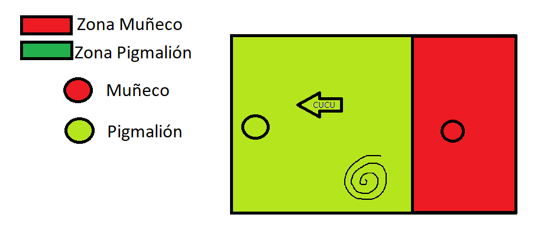

Urdemalas en su tercera fase, y al verse al borde de su muerte, saca la escopeta, con la cual tiene tres modos de disparo, entre los cuales irá alternando.

-Disparo concentrado, munición slug.

Este será dos disparos rápidos hacia el jugador y de daño aumentado. Apuntando a la posición en la que se encuentre Pigmalión a la hora de disparar cada cartucho.

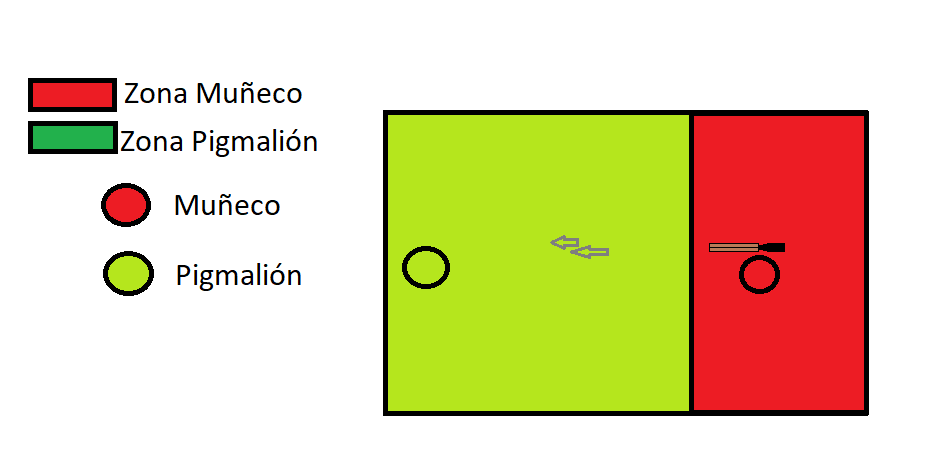)

-Perdigones

Urdemalas dispara la escopeta, disparando numerosos perdigones en un cono

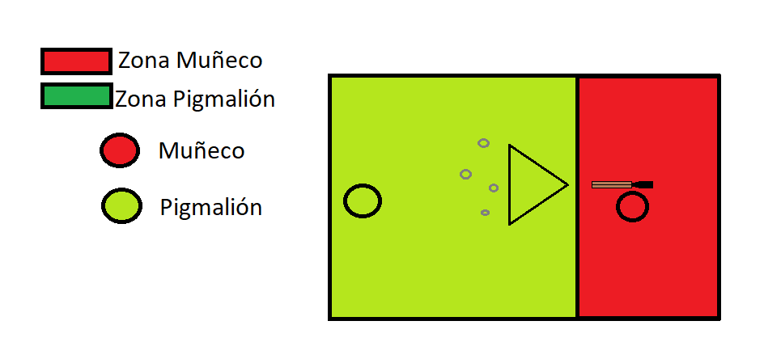

-Disparos que rebotan

Urdemalas dispara tres proyectiles, uno en linea recta hacia el jugador y otros dos en cono (uno a cada lado del disparo central). Los disparos en cono rebotarán en las paredes un número limitado de veces.

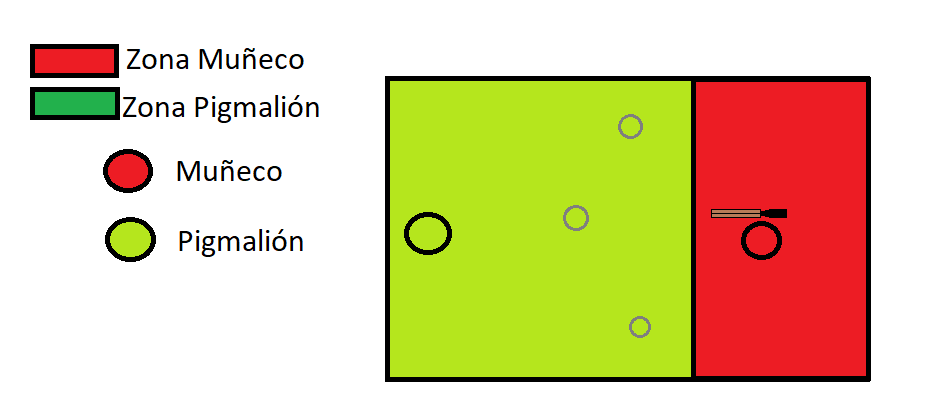

**Referencias**

-   *El Señor De Pigmalión, Jacinto Grau (1921)*

-   *Undertale, Toby Fox (2015)*

-   *Cuphead, StudioMDHR (2017)*

# PVLI-2020-21-CUCU's

PVLI UCM PROJECT 2020/21